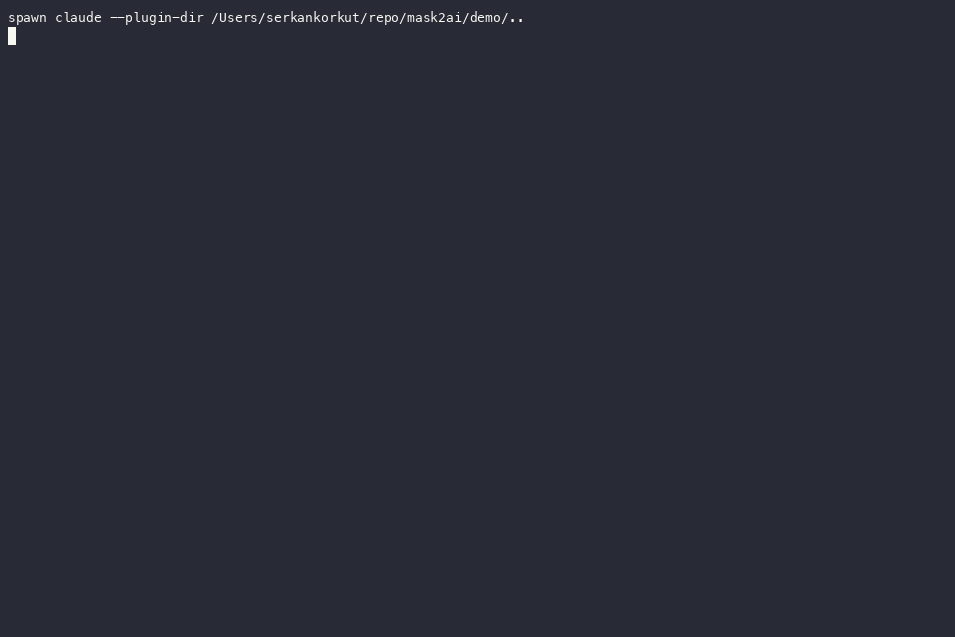
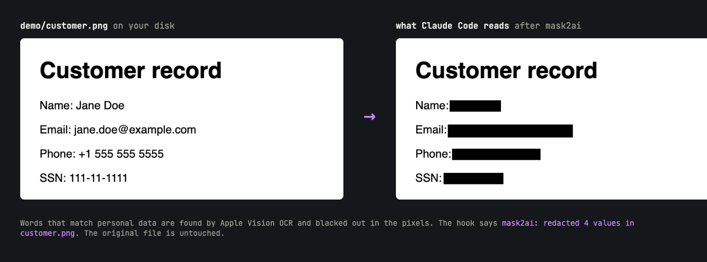
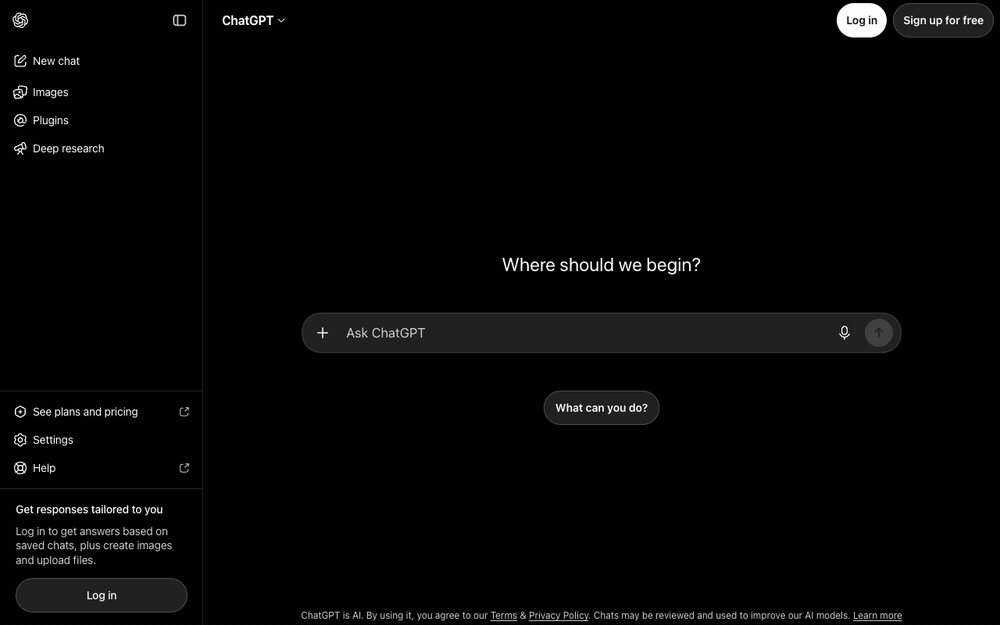
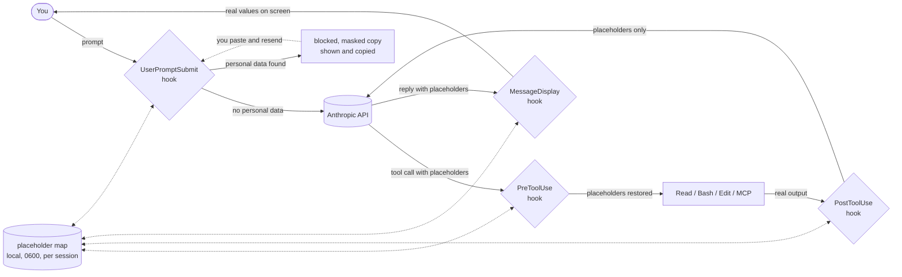

<p align="center"><picture><source media="(prefers-color-scheme: dark)" srcset="brand/logo-dark.svg"></picture></p>

# mask2ai

[](https://github.com/serkankorkut/mask2ai/releases/latest)
[](https://github.com/serkankorkut/mask2ai/actions/workflows/test.yml)
[](LICENSE)
[](https://github.com/serkankorkut/mask2ai/stargazers)

Protects your privacy when you use AI. mask2ai keeps personal data on your machine when you work with an AI assistant. It detects names, contact details, identity numbers, payment details and addresses in what you send, replaces them with placeholders before anything leaves your device, and puts the real values back on your screen.

Website and docs: [mask2ai.com](https://mask2ai.com)

Two integrations share one detection core:

| Environment | Integration | Verified by |
| --- | --- | --- |
| Claude Code CLI | plugin, six hooks, PDF to text, image redaction on macOS | `node test.js`, `node demo/prove.js` |
| claude.ai in Chrome | extension, chat text and Office or text uploads | `node demo/verify-web.js` |
| ChatGPT web (chatgpt.com) in Chrome | extension, chat text | `node demo/verify-web.js` |

## Demos

### Claude Code


The real Claude Code terminal with the plugin loaded. The first prompt is blocked and a masked copy is offered. The masked prompt goes through, Claude reads a CSV, the plugin masks 13 values in the tool output before the model sees it, and the model's reply comes back with placeholders that the plugin restores on screen. The model replies in this recording come from `demo/fake-api.js`, a local stand-in for the Anthropic API, so the recording does not depend on an account. The CLI, the hooks and the masking are real.

### Files in Claude Code



One prompt reads the sample PDF and the sample image. The PDF read is redirected to a masked text extraction, the image read to a redacted copy, and the reply shows what the model was given. The values in the reply are placeholders restored on screen.



The redacted copy is real output: `demo/customer-redacted.png` is what the Read tool received in the recording above. Words that match personal data are found by Apple Vision OCR and blacked out in the pixels. The original file is untouched.

### ChatGPT web



A real chat on chatgpt.com in Chrome with the extension loaded. The purple captions are added by the recorder. The text under "what ChatGPT actually received" is the `prompt` field captured from the outgoing request.

## What is detected

| Type | How it is found | Validation |
| --- | --- | --- |
| Email address | pattern | |
| Phone number | international `+..`, US, UK and Turkish formats | |
| Payment card | 13 to 16 digit shapes, spaced or plain | Luhn |
| IBAN | country code plus grouped alphanumerics | mod 97 |
| Turkish ID number (TC Kimlik No) | 11 digits | official checksum |
| US Social Security number | `ddd-dd-dddd` | |
| Date of birth | after a label such as `DOB`, `date of birth`, `doğum tarihi` | |
| Passport or ID number | after a label such as `passport no`, `kimlik no`, `ehliyet` | |
| Turkish licence plate | `34 ABC 123` | |
| Public IPv4 address | excludes private, loopback and link-local ranges and version strings | |
| Person name | after a title (`Dr.`, `Sayın`), a cue (`my name is`, `Regards,`, `Benim adım`), a label (`name:`, `"firstName":`), or derived from a masked email (`jane.doe@` also hides `Jane` and `Doe`) | shape check |
| Street address | after a label (`address:`, `adres:`), US and UK street shapes, Turkish `Mah.` / `Cad.` / `Sok.` shapes with `No:` | shape check |

Detection is pattern based and works in English and Turkish. Structured identifiers are matched reliably. Names and addresses are matched when there is a signal around them: a label, a title, a cue or a matching email. A bare name in free text with none of these passes through, and semantic facts such as health, religion or income are not detected. See Limits.

## Files

| File | Claude Code | claude.ai and ChatGPT in Chrome |
| --- | --- | --- |
| Text: .txt, .md, .csv, .json, .xml, .html, .yaml, .log, source code | masked in tool output | masked when uploaded |
| Office: .docx, .xlsx, .pptx | Claude reads these through scripts, whose text output is masked | masked in place when uploaded: the XML text inside the zip is rewritten, formatting and images untouched |
| PDF | the Read is redirected to a masked text extraction (PDFKit); the raw PDF is never read by the model. A PDF with no extractable text is withheld | uploaded uninspected, a toast says so |
| Image: .png, .jpg, .gif, .webp | the Read is redirected to a copy where the words that match, found by Apple Vision OCR, are blacked out in the pixels | uploaded uninspected, a toast says so |

PDF and image handling in Claude Code needs macOS with the Swift toolchain (`xcode-select --install`); the helper in `hooks/vision.swift` is compiled once into the plugin data directory on first use. On other systems PDFs and images pass through with a warning.

## How it works



Everything left of the API runs on your machine. The API only receives placeholders. In the browser the same detection runs inside the page: the outgoing chat request is rewritten before it is sent, and placeholders in the rendered page are swapped back to the real values.

## Install

### Claude Code

```
/plugin install mask2ai --marketplace serkankorkut/mask2ai
```

Claude Code asks you to confirm the marketplace source, then to pick a scope. On Claude Code older than 2.1.275, add the marketplace first:

```
/plugin marketplace add serkankorkut/mask2ai
/plugin install mask2ai@mask2ai
```

Choose the user scope to cover every project. Requires Node.js 18 or newer on `PATH`. To try a checkout without installing:

```
claude --plugin-dir /path/to/mask2ai
```

### claude.ai and ChatGPT in Chrome

1. Clone or download this repository.
2. Open `chrome://extensions`, enable Developer mode, choose Load unpacked and select the repository folder. The `manifest.json` at the root is the extension. Chrome 111 or newer is required.
3. Open claude.ai or chatgpt.com. A "mask2ai: on" toast confirms the extension is active.

After changing the extension files, click the Reload icon on the mask2ai card in `chrome://extensions`. The version shown on the card comes from `manifest.json`; if it does not match the file, Chrome is still running the old build.

**First test.** Open a new chat and send a message with made-up data, for example:

```
Write a short note to jane.doe@example.com confirming her phone +1 555 555 5555 and SSN 111-11-1111.
```

Expected: a toast "mask2ai: masked 3 values before sending" appears bottom right, your message bubble shows the values you typed, and the reply is written around placeholders the assistant received, shown to you with the real values. To see what actually left the browser, open DevTools, Network, select the `completion` or `conversation` request and look at its payload.

## What you will see

**In Claude Code**

- At session start: "mask2ai active: personal data in prompts and tool output is masked before it reaches the model".
- When a prompt contains personal data: the prompt is blocked before it is sent and the masked copy is shown. On macOS the masked copy is also placed in the clipboard. Paste it and send.
- After a tool result is masked: "mask2ai: masked N values in Read output" under the tool call.
- When Claude edits a file or runs a command that contains a placeholder, the real value is restored before the tool runs, so edits match and commands work.
- When Claude's reply contains a placeholder, the real value is shown on screen. The transcript keeps the placeholder.

**In Chrome**

- A toast reports how many values were masked each time you send a message.
- The assistant replies with placeholders; the page shows the real values. The placeholder map lives in the tab's `sessionStorage` and is gone when the tab closes.

## Verify

Unit tests for detection, restoration and request rewriting:

```
npm test
```

Proof that nothing personal reaches the API from Claude Code. The script starts a fake Anthropic API on localhost, points the real `claude` binary at it, drives two sessions and inspects every request body: a prompt with an email must produce zero requests, and a file read must arrive as placeholders only.

```
node demo/prove.js
```

Verification of the extension on the real sites. Headless Chrome loads the extension on claude.ai and chatgpt.com, sends a chat request from the page, including a gzip-compressed body as claude.ai uses, and checks that the captured body contains placeholders only and that the page restores them.

```
node demo/verify-web.js
```

If you prefer your own instrument, point `ANTHROPIC_BASE_URL` at a logging proxy such as mitmproxy and read the traffic yourself.

## Limits

- Detection is pattern based, not a language model. A name in free text with no label, title, cue or matching email nearby is not detected. Labels such as `name:` can also catch values that are not personal.
- Semantic personal data, for example health conditions, religion, ethnicity or income stated in prose, is not detected.
- In the browser, PDF and image uploads are not inspected; a toast says so. Office and text uploads are masked. Upload masking is verified on claude.ai; ChatGPT web uploads use a two-step flow that has not been verified.
- Image redaction relies on OCR. Text the OCR cannot read, handwriting, or personal data that is not text, such as a face, is not redacted.
- Claude Code hooks cannot rewrite a prompt, only block it, so a prompt containing personal data has to be resent in masked form.
- The Chrome extension rewrites requests made through the page's `fetch`. It has been verified against the current claude.ai and chatgpt.com request formats, JSON and form-encoded, plain and gzip-compressed. A change in either site's client may require an update.

## Technical details

**Hooks are child processes.** Claude Code runs `hooks/mask.js` once per event with a JSON payload on stdin. The script prints a JSON decision on stdout, or nothing to leave the event untouched. There is no daemon, no network listener and no dependency beyond Node.js.

**Six events, one script.** `hooks/hooks.json` registers the same command for `SessionStart`, `UserPromptSubmit`, `PreToolUse`, `PostToolUse`, `MessageDisplay` and `SessionEnd`.

- `UserPromptSubmit` receives `prompt`. On a hit it returns `decision: "block"` with the masked text in `reason` and, on macOS, copies it with `pbcopy`.
- `PostToolUse` receives `tool_response` in whatever shape the tool uses. Every string in it is masked and the same structure is returned as `hookSpecificOutput.updatedToolOutput`.
- `PreToolUse` receives `tool_input`. Placeholders are swapped back to real values and returned as `hookSpecificOutput.updatedInput`. For a `Read` of a PDF or an image the file is converted first, to a masked text file or a redacted image under the plugin data directory, and the Read is redirected to that file. Rewriting the output afterwards is not enough: Claude Code attaches the original PDF as a document block next to the tool result, which the proof caught.
- `MessageDisplay` receives each streamed `delta` of the assistant's text and returns it with placeholders restored in `displayContent`. Only the screen changes.
- `SessionStart` returns a status line for the user and one line of context telling the model that `__PII_*__` tokens are opaque literals to copy verbatim.
- `SessionEnd` deletes the session's placeholder map.

**Detection is an ordered pattern list** in `core/pii.js`. Each entry is a type, a regular expression and an optional validator. Emails run first so their digits are not later read as phones; cards, IBANs and Turkish ID numbers run before phones for the same reason. Label, title and cue patterns capture only the value, and a shape check rejects values such as `name: mask2ai` or `address: 0x7fff`. After the static pass, the local part of every masked email is split into tokens, and each token is masked where it appears capitalised or in capitals, accent-insensitively, which is how `jane.doe@` also hides `Jane` and `DOE` in a CSV column.

**Placeholders are content-addressed.** A value becomes `__PII_<TYPE>_<6 hex digits of a hash of the value>__`. The same value yields the same placeholder in a prompt, a file read and a grep result without a lookup, hooks running in parallel cannot disagree, and after a resume a single re-read rebuilds the map. Underscores keep the token a single word for the model and harmless inside code.

**The map is a local append-only file.** Placeholder to value pairs are appended as JSON lines to `$CLAUDE_PLUGIN_DATA/<session_id>.jsonl`, created with mode `0600`. Small appends are atomic on POSIX, so parallel tool calls never lose an entry. The file is deleted at `SessionEnd`.

**The extension** (`manifest.json`, `extension/`) injects `core/pii.js`, `extension/rewrite.js` and `extension/content.js` into claude.ai and chatgpt.com at `document_start` in the page's main world. `content.js` wraps `window.fetch`. For requests to the chat endpoints it decodes the body, whether a JSON string, a form body, a byte array or a gzip-compressed byte array, masks the text fields (`prompt`, `parts`, `extracted_content`, `text`, `content`), re-encodes it in the original form and forwards it. A `MutationObserver` restores placeholders in rendered text, skipping editable fields.

**What still leaves the machine.** Placeholders, everything the patterns do not recognise, file paths, and your prompt once you resend it in masked form.

## Chrome Web Store

`scripts/pack-extension.sh` builds `dist/mask2ai-extension-<version>.zip` containing only the files the extension needs. `store/listing.md` holds the listing text, permissions justification, privacy answers and the submission steps.

## Development

```
npm test                     # unit tests
node demo/prove.js           # Claude Code wire proof, needs the claude CLI
node demo/verify-web.js      # extension verification in headless Chrome, needs Google Chrome
```

Re-record the Claude Code demos (the files demo uses `demo/claude-code-files.exp` and writes `demo/claude-code-files.cast` and `.gif`):

```
node demo/fake-api.js 8790 &
asciinema rec --window-size 120x36 -c "expect demo/claude-code.exp" demo/claude-code.cast
agg --theme dracula --font-size 13 --idle-time-limit 2 --last-frame-duration 4 demo/claude-code.cast demo/claude-code.gif
```

To record against the real model instead of the fake API, log in with `claude` and remove the three `ANTHROPIC_*` lines from `demo/claude-code.exp`.

Re-record the ChatGPT demo:

```
node demo/chrome-open.js https://chatgpt.com/
node demo/record-live.js chatgpt.com "<your message>" demo/chatgpt-web.gif
```

The marketing site for mask2ai.com lives in its own repository, github.com/serkankorkut/mask2ai.com.

## Continuing the work

`AGENTS.md` holds the working rules and the owner's release words; `HANDOFF.md` carries the context another person or agent needs to pick this up: repositories, verification commands, recording tricks, conventions and open work.

## License

MIT